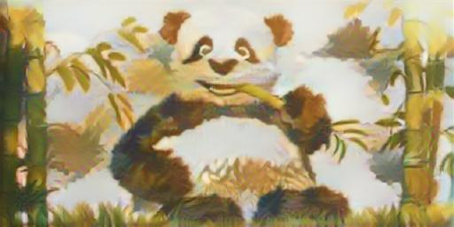

# 🖼️ Neural Style Transfer - Task 05

This project applies the artistic style of one image (e.g., a painting) to the content of another image (e.g., a photo) using Neural Style Transfer (NST) with TensorFlow Hub.

## 🚀 Features

- Transfer artistic style from one image to another
- Run entirely in Google Colab (no local setup required)
- Save and download the output image

## 🛠️ Requirements

- Python 3
- TensorFlow 2.x
- TensorFlow Hub
- Google Colab (recommended)

## 🔧 How to Run

1. Open the Colab notebook: [Click here to open in Colab](https://colab.research.google.com/)
2. Upload two images:
   - **Content Image**: The image you want to stylize (e.g., a photo)
   - **Style Image**: The image that contains the artistic style (e.g., a painting)
3. When prompted, enter the full file names exactly (e.g., `photo.jpg`, `art.jpg`)
4. The script will:
   - Display both images
   - Apply neural style transfer
   - Show the stylized result
   - Save and offer the output for download

## 📥 Output

- It will be automatically downloaded to your system.

## 💡 Tips

- Avoid spaces in file names. Use names like `photo.jpg` or `style.jpg`
- Use high-contrast, colorful style images for better results

